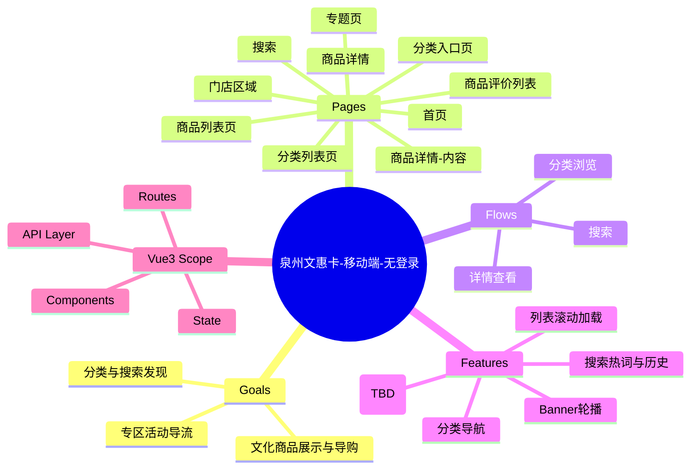

# 总览与思维导图

范围：移动端、无登录（不含购物车/下单/会员/消息）。

来源页面与脚本（截至 2026-03-17）：
- `/m/index.html`
- `/m/tmpl/category_all.html?gc_id=2` + `/zplugs/web/m_category_all.js`
- `/m/tmpl/product_detail.html?goods_id=142184` + `/m/js/tmpl/product_detail.js`
- `/m/tmpl/product_info.html?goods_id=142184` + `/m/js/tmpl/product_info.js`
- `/m/tmpl/product_eval_list.html?goods_id=142184` + `/m/js/tmpl/product_eval_list.js`
- `/m/tmpl/product_first_categroy.html` + `/m/js/tmpl/categroy-frist-list.js`
- `/m/tmpl/product_list.html?gc_id=2`
- `/m/tmpl/search.html`
- `/m/tmpl/store_area.html`
- `/m/special.html?special_id=23`

