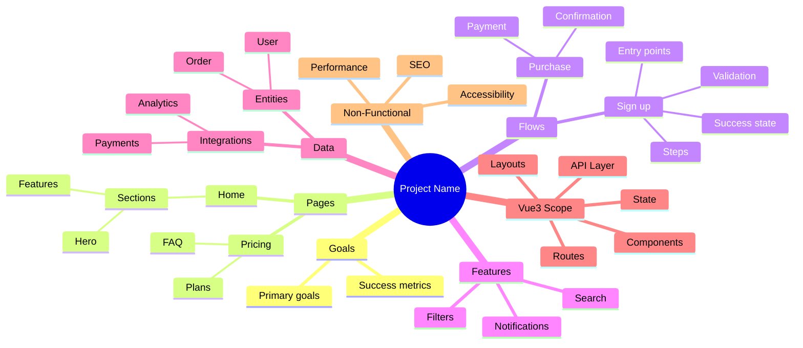

# Mindmap Format (Mermaid)

Use Mermaid `mindmap` syntax inside a Markdown code block.

```mermaid
mindmap
  root((Project Name))
    Goals
      Primary goals
      Success metrics
    Pages
      Home
        Sections
          Hero
          Features
      Pricing
        Plans
        FAQ
    Flows
      Sign up
        Entry points
        Steps
        Validation
        Success state
      Purchase
        Payment
        Confirmation
    Features
      Search
      Filters
      Notifications
    Data
      Entities
        User
        Order
      Integrations
        Payments
        Analytics
    Vue3 Scope
      Routes
      Layouts
      Components
      State
      API Layer
    Non-Functional
      Performance
      Accessibility
      SEO
```

Rules:
- Keep node labels short and noun-based.
- Cap depth at 3–4 levels.
- Mark unknowns as `TBD`.
